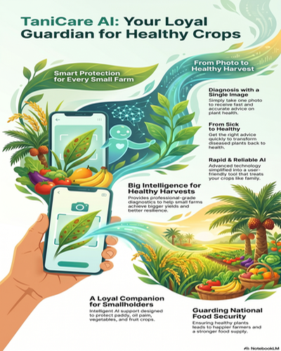

# TaniCare AI – Kawan Petani, Penjaga Tanaman



 

**Team:** Jexko-1Bit  
**Hackathon:** MyAI Future Hackathon 2026  
**Track:** Track 1 – Padi & Plates (Agrotech & Food Security)

## Project Overview

TaniCare AI is a smart mobile application designed to help Malaysian smallholder farmers detect crop diseases instantly and receive intelligent recommendations using Google AI technologies.

By combining **Gemini 1.5 Pro** for image analysis, **Google Earth Engine** for advanced satellite monitoring (NDVI + EVI + anomaly detection), and **real-time weather data**, the app provides actionable insights in simple Bahasa Melayu to reduce yield losses and support national food security goals.

## Key Features

- **Instant Disease Diagnosis**: Take a photo of any plant → Gemini AI instantly identifies disease, severity, treatment (organic & chemical), and prevention tips.
- **Advanced Satellite Analytics**: Real NDVI, EVI, and anomaly detection using Sentinel-2 data from Google Earth Engine.
- **Real-time Weather Integration**: Combines satellite health data with current temperature, humidity, and rainfall for smarter risk alerts.
- **Beautiful Analytics Dashboard**: Interactive line charts for NDVI trends and bar comparison between NDVI vs EVI.
- **Multi-State Support**: Works across Malaysia (Johor, Kedah, Perak, Selangor, Pahang, etc.).
- **Data Persistence**: All scans and analytics automatically saved to **Google Cloud Firestore**.
- **Farmer-Friendly UI**: Clean, modern design with intuitive bottom navigation.
- **Strict Legal Compliance**: AI recommendations are hard-coded to adhere to the Pesticides Act 1974, Plant Quarantine Act 1976, Biosafety Act 2007, and PDPA 2010.

## Technology Stack

- **Frontend**: Flutter (Material 3) + Riverpod 2.0 (advanced state management)
- **AI Analysis**: Google Gemini 1.5 Pro (multimodal)
- **Satellite Data**: Google Earth Engine (Sentinel-2)
- **Weather Data**: Open-Meteo Real-time API
- **Database**: Google Cloud Firestore (GCP)
- **Backend**: Google Cloud Run (Python / Firebase Genkit)
- **Charts**: fl_chart
- **Performance**: Optimized with const constructors, caching, and minimal rebuilds

## Project Structure

tani_care_ai/
├── lib/
│   ├── main.dart
│   ├── providers/
│   ├── screens/
│   ├── utils/constants.dart
│   └── gemini_service.dart, earth_engine_service.dart
├── backend_v2/
│   ├── main.py (Genkit Agent)
│   └── Dockerfile
├── pubspec.yaml
├── deploy_v2.sh
└── README.md

## How to Run

### Flutter App
```bash
flutter pub get
flutter run
```

### Backend (Google Cloud Run)
```bash
# 1. Authorize your terminal
gcloud auth login

# 2. Deploy the Genkit Agent
chmod +x deploy_v2.sh
./deploy_v2.sh
```

## Impact

- Helps reduce crop yield losses by 30–50% through early detection
- Directly supports DKMN 2030 and NAP 2.0 (National Food Security Policy)
- Empowers smallholder farmers with accessible AI technology
- Contributes to lowering Malaysia’s food import dependency

## Slogan
*"Satu Gambar, Banyak Harapan untuk Ladang Anda"*

---
**Developed by:** Jexko-1Bit  
**Date:** 16 April 2026

> **Disclosure:** In compliance with Section 4 of the MyAI Future Hackathon rules, this project's development, including orchestration and workflows, was fully assisted by AI (Google Antigravity & Gemini). Documentation were generated using Google NotebookLM.
